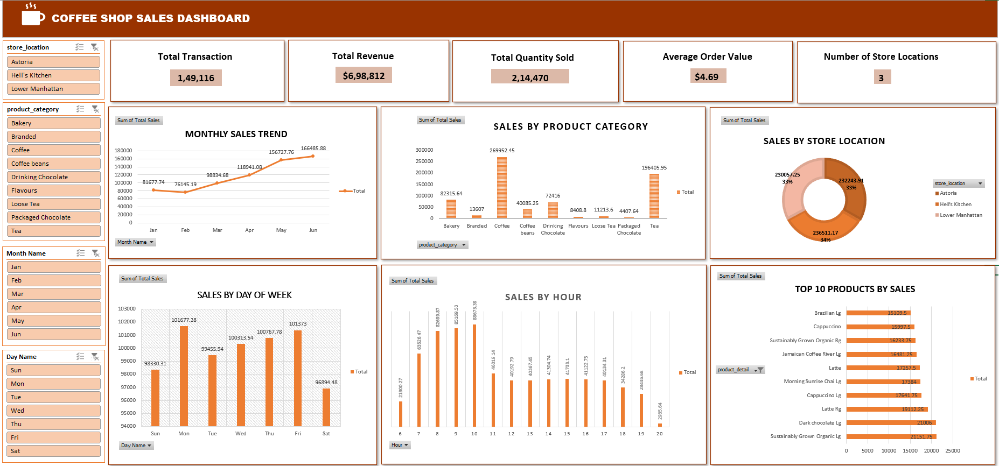

# ☕ Coffee Shop Sales Dashboard (Excel)

## 📋 Overview

An interactive Excel dashboard analyzing coffee shop sales data across 3 store locations, tracking revenue, transactions, and sales trends by product, time, and location to support business decision-making.

## 📸 Dashboard Preview

## 🛠️ Tools Used

- Microsoft Excel
- Pivot Tables & Pivot Charts
- Slicers (interactive filters)

## 📁 Dataset

Coffee shop transaction data covering 149,116 transactions across 3 store locations (Astoria, Hell's Kitchen, Lower Manhattan) from January to June.

## 🎯 Dashboard Features

- **5 KPI Cards:** Total Revenue, Total Transactions, Total Quantity Sold, Average Order Value, Number of Store Locations
- **Pivot Tables & Charts:** Sales by Month, Sales by Product Category, Sales by Store Location, Sales by Day of Week, Sales by Hour, Top Products by Sales
- **Interactive Slicers** for dynamic filtering across all visuals

## 🔑 Key Metrics

| Metric | Value |
| Total Revenue | $698,812.33 |
| Total Transactions | 149,116 |
| Total Quantity Sold | 214,470 |
| Average Order Value | $4.69 |
| Store Locations | 3 |

## 🔍 Key Insights

- Sales showed a **strong upward trend** from January ($81.7K) to June ($166.5K), nearly doubling over the period
- **Coffee** is the top-selling category ($269.9K), followed by **Tea** ($196.4K) and **Bakery** ($82.3K)
- Sales are **evenly distributed** across all 3 store locations, with Hell's Kitchen slightly leading ($236.5K)
- **Morning hours (7 AM–11 AM)** account for the highest sales volume, peaking at 10 AM ($88.7K)
- Sales are fairly consistent across all days of the week, with **Monday** as the highest ($101.7K) and **Saturday** the lowest ($96.9K)
- Top-selling individual product: **Sustainably Grown Organic (Large)** at $21.2K

## 📁 Files

- `Coffee Shop Sales.xlsx` — Excel workbook with raw data, pivot tables, and dashboard
- `Coffee_shop_sales_dashboard.png` — Dashboard screenshot

## 👤 Author

**Rosmi Cheriyan**  
Data Analytics Trainee | Aspiring Data Analyst / Power BI Developer  
🔗 [LinkedIn](https://linkedin.com/in/rosmicheriyan)
